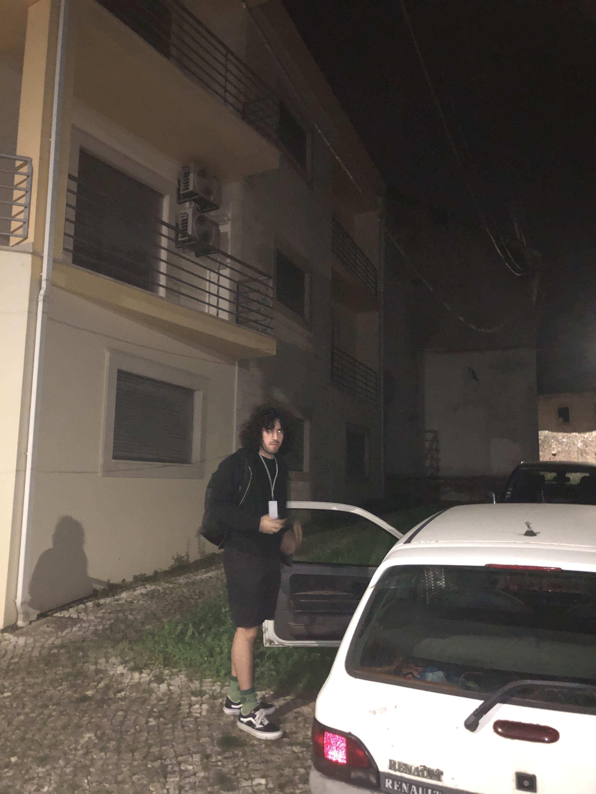

# PromptVision | Hackstreet Boys

Prompt Vision is an attempt at making an AI platform for generating presentations from text.

## Demo

Here is a link for downloading one of the final videos generated by our platform: [Download Video](https://we.tl/t-PLZY1zatYm)

## Architecture:

1. LLM generates the content of the presentation in a structured manner.
2. The tittles of each slide are fed into an LLM once again to generate prompts for creating the images using few-shot-based prompt engineering.
3. The prompts are sent to the image generation model to generate the images for the slides using AI.
4. The script for each slide passes through a text-to-speech model to generate the audio.
5. The content of the presentation is rendered into slides using HTML templates.
6. The audio files are sent to the deepfake service to generate the video.
7. The slides are combined with the deepfake videos to generate the final presentation.

## Challenges:

We noticed that we didn't have access to GPU enabled machines to execute our heaviest models (e.g. generating deepfakes & voice changer).
Since this was an essential part of our project, we wasted a lot of time trying to find a workaround for this issue. 
In this process we tried creating an EC2 with the hackathon account, creating an EC2 on demand with a personal account but couldn't get the quota request 
to be approved, creating a EC2 spot instance but couldn't get any machine associated to my fleet and also tried alternatives platforms like VastAi and RunPod.

Eventually, we reached the conclusion that we wouldn't be able to execute these models on the cloud, and so, on the last day at 6 AM in the morning,
in a desperate move, we decided to hit the road and go to João's house to host the models on his computer. We configured the router and exposed
the needed ports so we could access the deepfake service and his computer over SSH.

Before leaving, we attempted to access the service over the internet, and it worked! However, when we got to the venue, we weren't even 
able to access the service due to the network restrictions and overall poor speed 😔. No problem though, because we were able to access the outside
world through our phones using mobile data.

## Future Work:

- Upload your own videos and audio to be used to generate the deepfake.
- Upload the finalized videos to S3 and provide a pre-signed URL to download the video.

